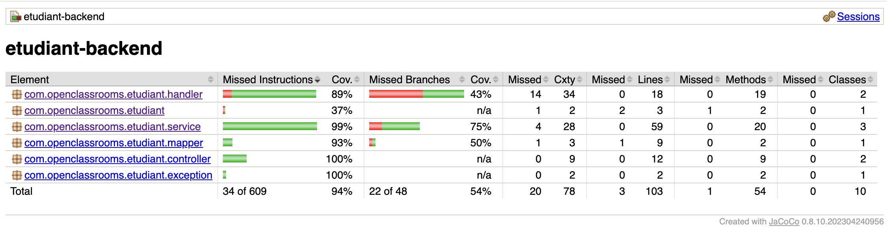
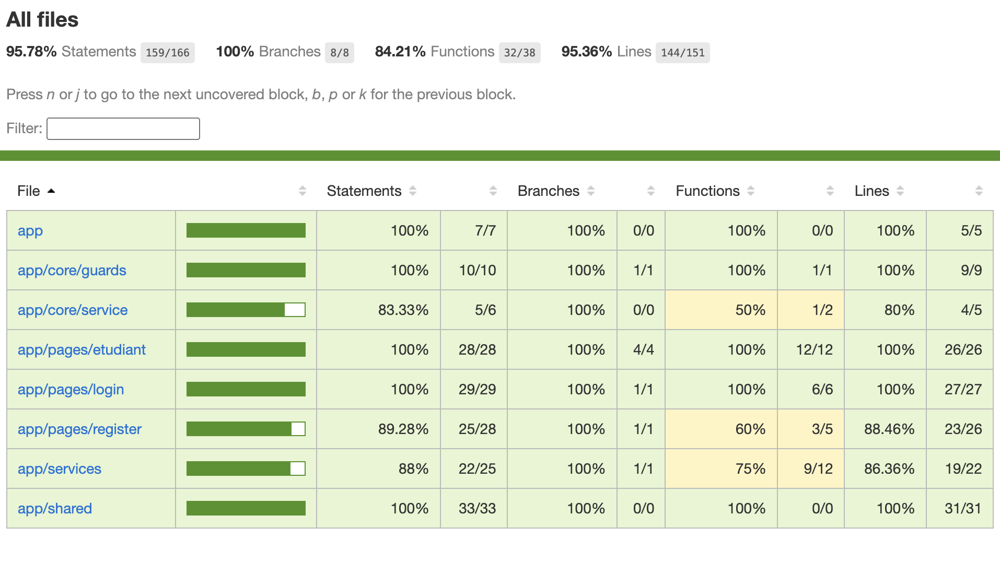
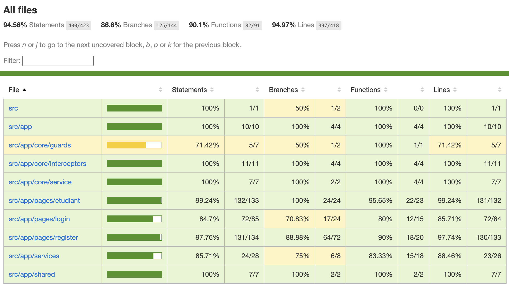

EtuBibliotheque

1. Backend
   - Goal : minimum 80% coverage
   - Overall Coverage : **94%**

   Testing Framework : JUnit & Mockito
   Coverage Tool : JaCoCo

2. Frontend (Unit & Integration)
   - Goal : minimum 80% coverage
   - Overall Coverage : **95.78%** (100% Branches)

   Testing Framework : Jest
   Coverage Tool : Jest (Built-in)

Tests included :

- app.component.spec.ts
- auth.guard.spec.ts
- auth.service.spec.ts
- etudiant.component.spec.ts
- etudiant.service.spec.ts
- login.component.spec.ts
- register.component.spec.ts
- user.service.spec.ts

3. End-to-End Testing & Browser Coverage
   - Goal : minimum 80% coverage
   - Overall Coverage : **94.56%**

   Testing Tool : Cypress
   Coverage Tool : Istanbul & Babel tracking (via `ngx-build-plus`)

   
